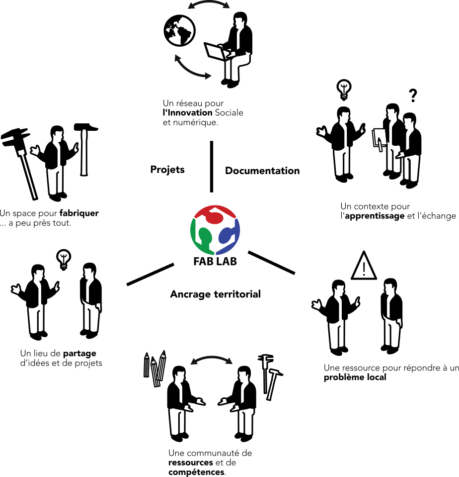
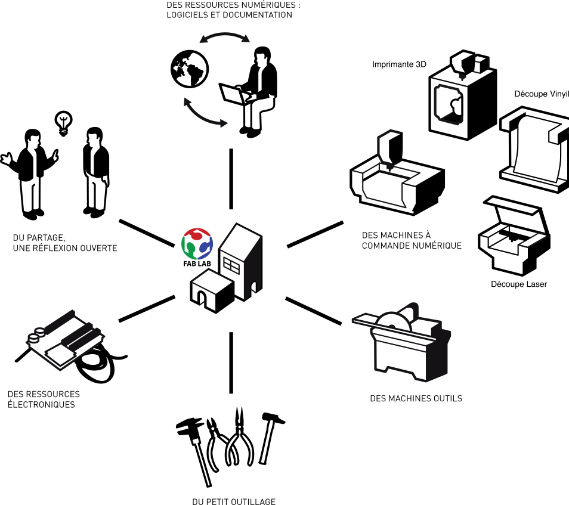
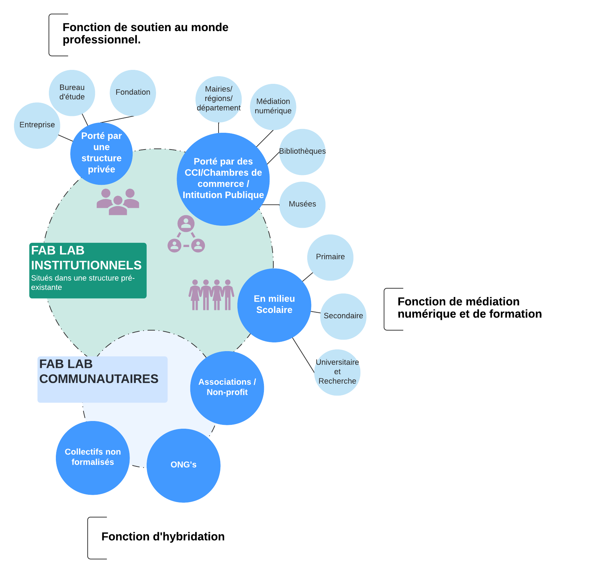
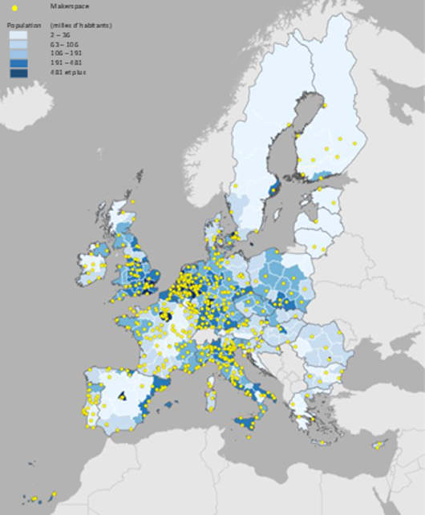
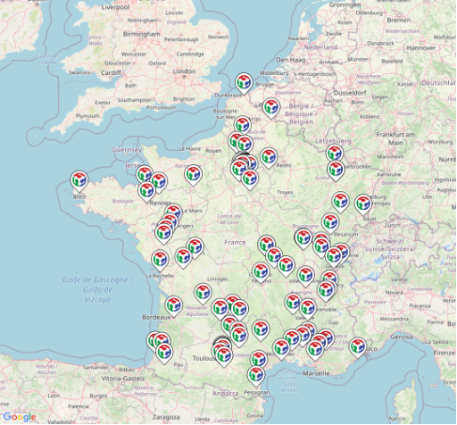
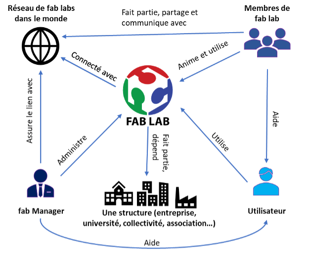

```{r setup, include=FALSE, echo=FALSE}
knitr::opts_chunk$set(echo = FALSE, 
                      fig.retina = 3, 
                      message = FALSE, 
                      warning = FALSE,
                      out.width = '60%',
                      fig.align = 'center')

options(knitr.kable.NA = '')
library(tidyverse)
library(kableExtra)
library(rmarkdown)
library(knitr)
library(flextable)
#render("Taylor-template.Rmd", output_format = "word_document")
#library(bibtex)
# library(bib2df)
# library <- bib2df("library.bib")
#library$URL <- NA
# 
# df2bib(library, file = "Refs.bib", append = FALSE)

set_flextable_defaults(fonts_ignore=TRUE)


library(usethis)
proj_sitrep()
```
# Introduction

Comme toute espèce, nous sommes le produit d’une longue évolution. 
Mais si autrefois les modifications prenaient des siècles pour se réaliser on se rend compte que ce rythme s'accélèrent à mesure qu'apparaissent de nouvelles innovations technologiques. 
Si l’on s’intéresse aux grands courants d’innovation on peut voir qu’à partir du $XX^{ème}$ siècle le modèle de Schumpeter, dit du « technology push », va être la référence. 
Ce modèle linéaire, qui considère que l’innovation est le résultat de la recherche scientifique ou technique, demeure aujourd’hui applicable dans bon nombre d’industries de pointe [@Edwards-Schachter2018].
Pour Schumpeter, l’innovation est la source d’un ou plusieurs facteurs tels que l’introduction d’un produit, une nouvelle méthode de production, l’apparition de nouveaux marchés, un changement managérial. 
Dans ses travaux, il va considérer comme acteur de l’innovation tout d’abord des entrepreneurs qui agissent au niveau d’entreprises dites « familiales », puis 30 ans plus tard les acteurs de l’innovation seront principalement les ingénieurs issus des départements de recherche et développement des grandes entreprises. 

A la fin des années 1970, Eric Von Hippel va, pour sa part, remettre en cause cette vision et identifier quatre acteurs de l’innovation, dont trois proviennent de l’extérieur de l’entreprise : les clients, les fournisseurs et les tiers (universités, consultants, etc.). Bien qu’il ne soit pas le premier à mettre en évidence l’existence d’acteurs de l’innovation en dehors des limites de l’entreprise, ses nombreux travaux vont déboucher sur une vision « démocratisée de l’innovation » [@VonHippel2010]. 
Il va ainsi mettre en évidence le rôle des utilisateurs comme innovateurs. 
En effet, aujourd’hui les évolutions technologiques des trente dernières années ont considérablement accru les opportunités d’innover offertes aux utilisateurs. 
C’est ainsi que l’on voit se développer fortement, à travers le monde, les mouvements de « maker » (ce terme anglophone générique peut ici être approcher par celui de créateur, constructeur en français).
Dans cette nouvelle approche, où les utilisateurs des innovations vont être ceux qui les conçoivent, voire les produisent eux-mêmes, il faut complètement repenser l’approche économique, managériale et politique. 
Pour illustrer l’ampleur de ce mouvement, on peut donner deux exemples récents : le premier est la volonté du gouvernement américain dans son programme de développement économique «Manufacturing USA»^[plus de détails: https://www.manufacturingusa.com/] de voir les « makers » devenir des acteurs à part entière de l’économie en passant de créateur à fabricant; le second réside dans les moyens donnés par la Commission Européenne à la recherche et l’open science pour permettre « d’ouvrir le processus d’innovation à des personnes ayant de l’expérience dans d’autres domaines que le monde universitaire et scientifique. » ^[https://ec.europa.eu/info/research-and-innovation/strategy/past-research-and-innovation-policy-goals_en]. 

Si cette production matérielle citoyenne par les « pairs » est aujourd’hui rendu possible et ne cesse de croitre, c’est avant tout grâce à la multiplication des espaces partagés de fabrication tels que les « hackerspaces », « makerspaces » et autres. 
Parmi tous ces espaces les fab labs ou « laboratoires de fabrication » ont vu leurs nombres exploser des leurs création en 2001 par Neil Gershenfeld directeur du laboratoire « Center for Bits and Atoms » au « Massachussets Institue of Technology (MIT) ». 
Bien qu’ils soient très souvent associés aux autres ateliers de fabrication numérique, les fab labs ont leur propre identité et surtout dispose de leur propre réseau. 
En effet les fab labs offrent la possibilité de partager des ressources et des projets à une échelle mondiale au sein du réseau qu’ils constituent, contrairement aux autres espaces de créations qui sont très souvent indépendants et sans relations entre eux. La philosophie première lors de la création des fab labs a été comme le dit Neil Gershenfeld : « Amener les gens du monde entier à devenir des protagonistes de la technologie plutôt que de simple acteur » [@Gershenfeld2012; @Gershenfeld2005]. 
Afin de bien comprendre ce que sous-tend cette idée nous proposons ici d’utiliser une analyse contextuelle permettant un questionnement méthodique et exhaustif des caractéristiques principales des fab labs à savoir la méthode QQOQCP.  


Dans un premier temps, nous verrons le « Quoi » et plus précisément ce qu’est un fab lab, ses éléments constitutifs matériel ou non, et enfin la diversité de ceux-ci. 
Dans un second temps nous rappellerons le « Pourquoi » et à travers “le Pour quoi” nous présenterons les projets développés dans les fab labs. Après avoir géolocalisé ces derniers nous détaillerons la gestion et les modes de gouvernances qui s’y appliquent pour fini par donner quelques pistes sur leur possibles évolutions dans le futur.

#	Quoi : qu’est-ce qu’un fab lab ? 

D’un point de vue sémantique, fab lab est l’acronyme de « Fabrication Laboratory » ou laboratoire de fabrication. 
Ce terme, à forte connotation technique, du principalement à l’usage intense dans ses lieux des machines à contrôle numérique, cache parfois la réalité première d’existence des fab labs qui est avant tout d’offrir des espaces sociotechniques ouverts aux rencontres, aux apprentissages et au partage. 
Ils favorisent des échanges informels nécessaires à la créativité et à la capacité d’exploration. 
Ils sont centrés sur "des pratiques du faire" qui sont un préalable à la diffusion de la fabrication numérique en open source. 


Comme indiqué dans l'introduction, l’idée initiale des fab labs est née sous l’impulsion du professeur physicien et informaticien Neil Gershenfeld du MIT au sein du CBA. 
En 1998, le professeur Gershenfeld a fait le choix pédagogique de mettre à disposition de ses étudiants certaines technologies de dernière génération à ce moment (ex : des lasers, des découpeuses à eau et des microcontrôleurs).
L’objectif premier était de créer avec les étudiants ingénieurs de l’époque d’autres machines, à partir de celles-ci. 
Or ces outils, outre le fait d’être puissants et sophistiqués, étaient complexes à utiliser. 
Il aurait fallu un cours d’une année entière pour simplement en comprendre le fonctionnement. 
C’est en partant de ce constat qu'il décide avec quelques collègues de mettre sur pied un cours d’un semestre destiné à tester ce qu’ils pourraient bien produire grâce à ces machines. 
Conçu à la base pour un petit groupe d’étudiants, le cours *« How To Make (almost) Anything » ou « Comment fabriquer (presque) n’importe quoi »* est devenu un programme très populaire où les étudiants (pas forcément du cycle ingénieurs, mais aussi des artistes, designers ou architectes) sont encouragé à développer des fabrications personnelles en utilisant les équipements techniques [@Gershenfeld2005].

Ce cours est une forme d’expérimentation et d’observatoire de ce qu’un groupe d’individus issus de disciplines différentes peut produire par et pour eux-mêmes en manipulant des données et des objets -*‘bits and atomes-*’ s’ils ont accès collectivement à un ensemble d’outils de prototypage. Contrairement aux approches classiques de spécialisation, ce cours vise à enseigner à des groupes d’étudiants pluridisciplinaires comment manipuler les divers outils de conception et de fabrication, et ce dans des démarches de fabrication personnalisées, pour soi-même - connu comme Do-It-Yourself (DIY) ou « faire soit même ».

Les fab labs selon le MIT à Boston sont conçues avec la volonté de créer un réseau mondial distribué répondant à des principes spécifiques codifiés dans « la charte des fab labs » [@Mikhak2002] mise en place par le MIT ^[http://www.labfab.fr/charte-fablab/]. 
L'organisation sous forme de réseau viens du fait que les fab labs visent à la démocratisation des outils de fabrication personnelle en faisant une analogie avec la révolution des ordinateurs portables. 
Ils promeuvent donc des formes d’apprentissage par le « Faire » ainsi que l’entraide, l’accès et le partage d’information entre usagers. 
Leur devise commune est « Make, Learn, Share » ou « Fabriquer, Apprendre, Partager ».

## Un espace riche de nombreuses ressources

Les fab labs permettent un processus d’apprentissage au niveau individuel comme collectif. 
Cela se traduit par une intégration de compétences digitales et de fabrication numérique qui vont permette des innovations à une échelle locale ou entrepreneuriale. 
Au niveau territorial, les fab labs jouent aussi un rôle attractifs en permettant de créer des « plateformes d’innovation ». 
Ils facilitent certaines démarches d’innovation ouverte pour les entreprises en tant qu'intermédiaires de réseau et de connaissances. 
La fabrication numérique personnelle peut apporter davantage d’autonomie aux citoyens, pour décentraliser et démultiplier les expérimentations et le développement technologique. 
Ils permettent également, de créer les conditions nécessaires à la mise en œuvre d’un système de production distribué basé sur une circulation des données au service de productions locales (figure 1).

```{r definition, fig.cap= "Fab lab: lieu et réseau d'équipement, de connaissances et de compétences pour développement de projets. (Adaptation : Pictogrammes de Laura Pandelle sous licence CC-BY-NC-SA) "}

```


Le fab lab en tant qu'espace physique doit être accessible et convivial. Il se veut un lieu où les machines et les utilisateurs doivent cohabiter (figure 2). 
On observe que les superficies de ces lieux varient généralement entre 20 et 200 m2. 
En termes d'équipements, les recommandations de la charte concernent les imprimantes 3D, les équipements de prototypage électronique et mécanique, les fraiseuses numériques et les machines de découpe laser et découpe vinyl. 

```{r def2, fig.cap= "Les ressources physiques et humaines au sein des fab labs"}

```

## Structure et typologie des fab labs


Les fab labs sont pensés pour être ouverts au public, mettre des machines à disposition de tout à chacun et surtout permettre aux usagers de partager leurs projets avec l’ensemble du réseau mondial.
Bien qu’il soient né dans un milieu universitaire, les fab labs sont présents aujourd’hui au sein des différentes structures publiques et privées et leurs activités sont orientés selon le besoin de chacune [@Morel2016].

Il existe une grande diversité de fab labs et de modèles organisationnels en fonction des communautés.  
Le tableau 1 présente les typologies des fab labs en lien direct avec leurs lieux d’implantation. 
Par exemple, il est possible de catégoriser les fab labs en les divisant en trois groupes, à savoir 
(i) et Institutionnels (au sein d’une structure d’enseignement, d’un hôpital, etc.),  
(ii) Entrepreneurials (au sein d’une entreprise privée ou publique) ou (iii) Militant (grand public pro/amateur, avec une association ou une collectivité territoriale). 

Par ailleurs, Osunyomi et al. @Osunyomi2016 ont proposé quatre types de fab labs tels que : basé sur la communauté, basé sur l'éducation, basé sur les business et les "autres" catégories comprenant (espace municipal, installations de recherche indépendantes, et centres scientifiques). 

```{r table1}
library(readxl)
onglet <- excel_sheets("tables/tables1.xlsx")
table_1 <- read_excel("tables/tables1.xlsx", sheet = onglet[1])

#table_1 <-  table_1 %>%  set_names(" ", "PLA", "Recycled PLA")

table_1 %>% flextable() %>%
  set_caption("Les typologies et les lieux de fab labs") %>%
  width(j=1:4, width = c(1, 1.5, 1.5, 1)) %>% 
  theme_zebra()
```


Chaque type a ses caractéristiques spécifiques, utilisateurs et équipements. 
Cependant chaque fab lab n’est pas toujours monotype. 
Par exemple, il existe des fab labs de type éducationnel et grand public, qui sont ouverts à la fois aux personnes à titre privées et aux étudiants membres d’une institution. 

Enfin, il est aussi possible de donner des axes de structuration par rapport à la gouvernance dites top-down ou bottom-up. 
Cette structuration intègre alors les aspects juridiques et les acteurs à l’origine de l’initiative [@Capdevila2015]. 

En synthèse, les typologies proposées dans la littérature s'appuient généralement sur deux logiques principales : selon les orientations (économique ou sociale) et selon leur situation juridique (universitaire, scolaire, associatif)


## Des espaces mobiles  

Au début de leur apparition, les fab labs ont été implantés dans les grands campus universitaires et dans les grandes villes. 
Les zones rurales restaient éloignées de ces lieux pourtant dédiés à la démocratisation des outils numériques et au partage des connaissances. Dans ce contexte, l’idée d’un fab lab mobile est née pour permettre l’extension de l'apprentissage pratique et des services d'un fab lab fixe à un plus grand nombre d'utilisateurs (grand publique, collèges, lycées, etc.), notamment dans les zones dites « désertes ».

Le fab lab mobile est une plateforme, un camion ou une remorque aménagée, équipée de l'ensemble des machines trouvées dans un fab lab traditionel. Cette disposition permet de se déplacer en missions pour mettre à disposition les moyens numériques et techniques d’un fab lab fixe ainsi que les connaissances de son équipe au service des utilisateurs pour réaliser leurs projets.
Au Pérou, par exemple, le Floating fab lab est un bateau de narcotrafiquants reconverti en fab lab mobile éco-responsable. Il navigue sur une portion du fleuve Amazone, offrant une éducation et un accès à la technologie aux nombreuses communautés isolées qui y habitent ^[Voir le detail: https://www.makery.info/2016/08/01/en-amazonie-un-fablab-flottant-veut-connecter-jungle-et-technologie/].
En France, le Nomad’Lab (figure 6) est le 1er fab lab mobile construit en 2014 par l’ENSGSI et l’ERPI comme une extension du Lorraine Fab-Living-Lab® pour servir les zones autour de la région Grand Est.

```{r fablabmobile, fig.cap= "Le Nomad’Lab – 1er fab lab mobile de France (https://factuel.univ-lorraine.fr/node/6779) ", out.width='50%'}
knitr::include_graphics("Figures/nomadlab.png")
```


# Pourquoi le fab lab ?

Après avoir clarifier ce qu’était un fab lab nous proposons dans ce paragraphe quelques pistes éclairant le « Pourquoi » des fab Labs et plus précisément ce qui a conduit à leur apparition puis nous répondrons au « Pour quoi » et préciserons les buts recherchés lors de la création et les principales fonctions de ces espaces.

## Les différentes fonctions des fab labs


Il est possible d’identifier trois grands types de fonctions pour les fab labs [@Garnier2020] ; illustrés dans la figure 4 :

- Une fonction de médiation numérique et de formation par les pairs ;
- Une fonction d’hybridation (des publics, des services et des compétences) ;
- Une fonction de soutien au monde professionnel.

La fonction de médiation est centrée sur la découverte des machines et outils technologiques présentes dans le lieu. 
Il s’adresse pour la plupart des cas aux utilisateurs novices (ex : enfant et/ou bricoleurs). 
Le fab lab permet également d’ouvrir à une pédagogie active par la manipulation dont les écoles et les universités sont les principaux utilisateurs. 

D’un autre côté, le prototypage et la création d'objets dont la conception répond aux besoins des entrepreneurs est un autre usage des fab labs afin de soutenir le monde professionnel. 
Du fait de la flexibilité des équipements et d'un coût faible, le fab lab permet l’itération, l’échange et la formalisation des projets innovants pour une communauté/un marché. 


Finalement, dans une optique de diffusion de la technologie, la fonction d’hybridation des fab labs permet à certains utilisateurs ou au grand public d’avoir une première connaissance de certaines avancées technologiques telles que l’impression 3D, les objets connectés, etc. 
En ce sens, le rôle de médiation et de facilitation est un élément clé dans l’écosystème du fab lab. 

```{r fablabfunctions, fig.cap= "Typologies des fab labs et leurs fonctions principales"}

```


# Où se trouvent les fab labs ?

En 2004 on recensait 6 fab labs. Aujourd'hui on estime leur nombre à près de 2000 dans 149 pays. 

## A l’échelle du monde

Au niveau mondial, c’est la Fab Foundation ^[https://fabfoundation.org/] qui représente le réseau international des fab labs. C’est une organisation américaine à but non lucratif issue du programme CBA fab lab du MIT.  
Sa mission est de « fournir l'accès aux outils, aux connaissances et aux moyens financiers pour éduquer, innover et inventer en utilisant la technologie et la fabrication numérique pour permettre à chacun de fabriquer (presque) n'importe quoi, et ainsi créer des opportunités pour améliorer les vies et les moyens de subsistance dans le monde entier ».


## Au niveau Européen 

Le centre commun de recherche (Joint Research Center) et service de la commission européenne chargé de la science et de la connaissance ont publié un rapport technique en 2017 étudiant le mouvement des makers dans l'Union Européenne (UE) [@Rosa2017]. 
Ce rapport a eu pour objectif « d'évaluer et de quantifier l'ampleur du mouvement des makers à travers l'Europe, en étudiant la distribution et l'activité des fab labs, des hackerspaces et des makerspaces en tant qu'espaces physiques où le phénomène se produit ». Ce rapport a recensé 826 fab labs et makerspaces dans les 28 pays de l’Union Européenne (EU28) répartis géographiquement comme visible dans la figure 5.

```{r Rosa, fig.cap= "Emplacement géographique des fab labs dans l'UE28 en 2017 superposé à la densité de population [10]", out.width='50%'}

```


Les fab labs et les makerspaces ont bénéficiés de nombreux projets européens depuis 2014. A titre d’exemple, le réseau FabLabNet ^[http://www.fablabnet.net/] a pu être créé en 2016 et financé par le programme européen Interreg Central Europe. 
Dans ce projet, 9 fab labs de 9 pays d'Europe centrale ont pu collaborer et échanger.
De manière plus étendue, l’organisation Vulca^[https://vulca.eu/] est très présente dans le paysage européen. 
C’est une organisation à but non lucratif qui a pour mission de « faire connaître les idées des citoyens aux décideurs politiques de l'UE en utilisant une approche ascendante ». 
Fondée en 2014, Vulca a commencé à tisser les liens entre les makers en Europe pour créer une communauté avec des activités transfrontalières permettant de mieux mettre en œuvre des solutions collectives. 
On peut voir le site de l’organisation que régulièrement des séminaires sont organisés. 
Une autre action majeure de Vulca est le déploiement du Vulca Tour pour lequel 356 communautés se sont réunies et 197 villes européennes ont été visitées. 
En mai 2017 et au sein d'Artilect à Toulouse, le Fablab Festival a été organisé. 
Plus de 150 structures se sont réunis autour du thème "Make Europe" mettant l'accent sur les fab labs européens. 
Le Fablab Festival a accueilli 20 fab labs européens, 104 fab labs français, 17 fab labs africains, deux asiatiques et deux américains.
L’UE a apporté un soutien financier d’un montant de 350 k€ à un projet pilote, « Makers' Mobility », pour définir et tester des politiques et des actions soutenant la mobilité et l'échange d'expériences entre les industries culturelles et créatives, les hubs créatifs, les makerspaces, les fab-labs en Europe. 
Ce projet a démarré en 2020, il est conçu comme une première étape vers le développement d'un cadre européen visant à stimuler la mobilité des makers, ainsi que l'échange de bonnes pratiques entre les fab labs (https://culture.ec.europa.eu/calls/pilot-project-makers-mobility).

## Au niveau national 

Le site spécialisé Makery^[https://www.makery.info/] recense en 2021, 492 fab labs, coworkingspaces, hakerspaces, makerspaces, tiers-lieux, ateliers de fabrication numérique en France.

De meme, le Réseau Français des Fablabs (RFFLabs) est une organisation à but non lucratif RFFLabs destinée au partage de veille sur les fablabs français et francophones^[http://www.fablab.fr/]. Il « favorise l’acquisition, la transmission et la production des savoirs et des compétences par l’expérimentation, le faire soi-même, l’échange de pairs à pairs et la pratique collective ». Le Conseil Scientifique du RFFLabs, a mené en 2018 une enquête visant à produire un panorama des fablabs en France. Le travail a été publié dans le livre blanc - Panorama des fab labs en France 2017-2018 [@RFFLabs2017]. 
Ce livre révèle qu’en 2018, il existe 150 structures revendiquant le titre de fab labs. Cette enquête réalisée à partir d’un questionnaire de 136 questions, auquel 59 fab labs ont répondu portait de manière détaillée sur la création, l’animation, l’administration, la gouvernance et l’inscription dans le réseau international de ces structures. 


Le site officiel fablabs.io est une plateforme open-source développée depuis 2014 par l'équipe du FabLab à Barcelone et en collaboration avec la Fab Foundation. 
Nous y trouvons la liste de tous les fab labs membre du réseau MIT, et plus précisément on peut observer que 98 fab labs français sont actifs dans ce réseau, répartis sur le territoire français comme le montre la figure 6. 

```{r fablabsio, fig.cap= "Répartition des fab labs français membres du réseau MIT selon la plateforme fablabs.io (en décembre 2021)", out.width='50%'}

```


# Qui gère et utilise les fab labs ?

Le fab lab n’est pas un simple lieu équipé par des machines, mais surtout une communauté de pratique, un groupe qui partage les même valeurs et intérêts. 
Comme nous l’avons dit auparavant, le fab lab repose sur la philosophie open source, et ses membres partagent des valeurs et des intérêts communs.
Cette communauté est le principal utilisateur, et animateur, du fab lab, il est donc possible de conclure qu’elle doit posséder une série de caractéristiques qui sont :

-	L’utilisation d’un « langage commun » ;
-	La connaissance partagée ;
-	Un propos commun ou une vision partagée qui pointe plus loin que l’intervention simple ;
-	Le dynamisme ;
-	L’ouverture et l’évolution.

## Les acteurs du fab lab 

Afin de répondre à la question du « qui utilise le fab lab ? », il est nécessaire de connaître le fonctionnement de sa communauté et le profil de ses acteurs. 
Bien que les fab labs ont pour vocation d’être ouverts au plus grand nombre de personnes, le profil le plus couramment vecteur de dynamisme au sein de cette communauté est celui du « maker ». 

Les makers peuvent être définis comme des passionnés d’informatique et d’électronique, des bricoleurs, des débrouillards, des ingénieurs et des artistes qui inventent et innovent pour le plaisir. 
Les makers s'appuient sur un ensemble diversifié de compétences instrumentales pour comprendre chaque besoin et prototyper chaque solution. 
Ils n'hésitent pas à mélanger les disciplines ou à aller sur le terrain pour comprendre un problème.
Ils brillent par leur capacité à combiner des idées et à élaborer des concepts innovants. 
Les makers sont motivés par l'expérimentation, l'itération à travers des prototypes conçus à partir des technologies disponibles. 
Reconnaître la complexité de chaque problème de manière systémique fait partie de leur façon de voir le monde. 
Ils aiment explorer et utilisent les outils programmables et industriels pour créer des systèmes physiques à des fins à la fois ludiques et utiles. 
Les makers vont au de-là des utilisateurs communs au sens où ils testent toutes les capacités des outils technologiques et pas uniquement l'usage premier de ces derniers.  Une autre caractéristique des makers est leur curiosité qui les fait appréhender et apprendre plus facilement des nouvelles techniques, méthodes, codes, algorithmes. 

La figure 7 montre les acteurs et les utilisateurs du fab lab type et leurs activités. Ils peuvent varier en fonction du contexte, de l’environnement ou de la finalité du lieu. 
Néanmoins, quel que soit la typologie du fab lab, on voit apparaître les acteurs et les utilisateurs présentés ci-après.


- Le Fab Manager : Il est chargé d’administrer, d’organiser et de gérer le fab lab, il doit surveiller l’état des machines, les réparer si besoin et en assurer la manutention. Il doit par ailleurs apporter une aide ponctuelle dans les projets aux utilisateurs, recevoir ces derniers, veiller au bon fonctionnement et enfin assurer les échanges avec les autres fab labs de par le monde. Il est employé de la structure dont le fab lab fait partie, quand il s’agit d’une entreprise, une université un hôpital ou une collectivité. Il peut aussi avoir un statu de bénévole quand il s’agit d’un fab lab attaché à une association par exemple.

- Les Membres du fab lab : Il s’agit des makers, hackers ou bricoleurs qui utilisent et qui animent le fab lab en permanence. Ils participent à la vie du fab lab et à son évolution. Ils aident aussi le fab manager dans ses tâches en recevant les utilisateurs et en les aidant sur leurs projets. Par ailleurs en tant que membre du fab lab ils ont la possibilité d’utiliser les ressources de ce dernier pour leurs projets personnels. Selon le type de fab lab, ces membres peuvent être une équipe d'employés de la structure, une association, etc.


```{r fablabacteurs, fig.cap= "Les acteurs et les utilisateurs du fab lab (inspiré de https://www.sqylab.org/schema-fablab/)", out.width='55%'}

```


##  Les utilisateurs du fab lab 


Le fab lab est, par principe, ouvert à tout le monde. Ses utilisateurs sont donc très variés (figure 7) :

- Des particuliers : Parmi ceux-ci, les jeunes (entre 19 et 25 ans), étudiants ou pas, qui sont en majorité disposés à faire des recherches et à apprendre pour développer ce qui leur plaît. Ils abordent des sujets en osant exprimer leurs idées, bien qu’ils ne soient pas des experts dans le domaine. Cependant, on trouve aussi des personnes plus âgées attirées par la technologie et disposées à dédier du temps à ces communautés, en créant leurs propres objets. Ceux-ci considèrent généralement cette activité comme un loisir. On peut aussi trouver tout type de personnes appartenant à des catégories sociaux professionnelles diverses.
- Des entreprises : Le fab lab offre aussi ses services aux entreprises qui veulent réaliser des prototypes et des projets. Ils bénéficient de la dynamique et du contact avec le grand publique afin de sortir du cadre classique et de pouvoir mener un projet qui nécessite de l’innovation ouverte et du travail collaboratif.
- Des collectivités et des associations : Certaines ont leurs « propres » fab labs, et les utilisent pour développer des projets, animer des manifestations ou des activités dédiées au grand publique. Ces collectivités peuvent solliciter d’autres fab labs pour les aider à monter leurs projets afin de créer des liens sociaux dans une communauté et participer au développement de son écosystème. A titre d’exemple, pendant la pandémie COVID-19, des associations et des coopératives ont utilisés les fab labs pour imprimer en 3D des visières.


# Comment créer et gérer un fab lab ?

La création d’un fab lab ne se résume pas à l’installation des machines dans un espace dédié. 
Avant de se lancer dans cette aventure, il est important de se poser des questions sur les étapes principales de création d’un fab lab. 
Une fois créé, comment le gérer ? et comment le faire fonctionner pour qu’il contribue au développement de son écosystème ?


## Comment mettre en place un fab lab ?

L’association Fab Foundation (https://fabfoundation.org/) propose une feuille de route pour la création d'un fab lab ; qui se résume en 9 étapes :

-	Trouver un lieu ou un local pour accueillir le fab lab. Le lieu d'accueil peut appartenir à n'importe quelle organisation gouvernementale, communautaire, académique ou privée. Le fab lab doit être hébergé par une organisation bien implantée pour assurer son succès. Parfois l’association existe avant d’obtenir l’appellation « fab lab » et disposait déjà de locaux, de machines et de partenaires, et il a simplement fallu la transformer [@RFFLabs2017]. Parfois, une institution souhaite « s’équiper » d’un fab lab et dans ce cas, un local au sein de l’institution sera utilisé pour sa création et son développement. 

-	Trouver un Fab Manager (ou une équipe) avec des compétences à la fois techniques pour l’utilisation des outils numériques et de prototypages, mais aussi à l’animation et la facilitation d’une communauté de pratique technique. Ce rôle d’animation est essentiel afin que chaque usager du lieu Fab Lab puisse trouver sa place dans la communauté.

-	Finaliser le partenariat / les accords contractuels avec les partenaires locaux (conseil municipal, région) et internationaux comme la Fab Foundation et le MIT. Afin de porter l’appellation de « FabLab », la structure doit respecter la charte des fab labs. Assurer le financement de ce fab lab. Obtenir un partenariat public et/ou privé approprié pour ce fab lab.

-	Identifier et préparer le site. Son choix est crucial : il doit être accessible à la communauté et ne doit pas décourager les utilisateurs potentiels.

-	Acheter, installer les équipements (cf. paragraphe 1.3) et préparer la mise en service de ce fab lab.

-	Former l’équipe des animateurs (technique et gestion) qui seront les formateurs des utilisateurs.  Identifier les projets en commençant par la résolution de problèmes locaux. Le fab lab sera intégré dans la grande communauté internationale des fab labs et il aura accès et participera à des projets réalisés au niveau mondial et de manière distribuée.

-	Lancer le fab lab par une cérémonie d'ouverture, en veillant à inviter les principaux acteurs de la communauté, du gouvernement et du secteur privé, afin qu'ils comprennent ce qu'est le fab lab et voient les premiers projets réalisés. Un site web est essentiel pour rendre visibles tous les projets, les ateliers et les événements liés à ses activités.


## Les modes de gouvernance des fab labs

Les fab labs reposent sur des structures de gouvernance autoorganisées ayant pour fonction de coordonner les dynamiques collectives de création de connaissance entre différents contributeurs : fab managers, contributeurs individuels, communautés de pratique. Il n’existe pas de principe hiérarchique ni de logique de marché régulant les interactions contributives [@Dechamp2019]. 

En raison de leur hétérogénéité en taille, en population, en modèle financier et en activités, il n’est pas facile de déduire un modèle de gouvernance général pour les fab labs. 
La gouvernance du fab lab ne se limite pas au financement d’un poste de fab manager à l’achat d’équipement et de consommable. 
Elle mérite une attention particulière, non seulement parce que les produits communs réalisés par les pairs nécessitent un cadre de propriété intellectuel collectivement défini, mais aussi parce que les makers en tant qu'utilisateurs des fab labs et les institutions en tant que principaux soutiens des fab labs n’abordent pas de manière similaire cette question [@Troxler2013]. 
Troxler @Troxler2013 pour sa part, aborde ce sujet d’une manière pragmatique en observant deux acteurs principaux :

- Les makers des fab labs, d'une part, qui se concentrent sur leurs propres projets de fabrication et font appel à leurs relations latérales en cas de besoin, mais ne se préoccupent généralement pas de l'organisation de ces relations au-delà de ces besoins ponctuels. 
De temps en temps, ils souhaitent un meilleur accès, plus efficace, aux ressources du réseau. Jusqu'à présent, ils n'ont trouvé que très peu de moyens durables et évolutifs pour créer de nouvelles façons d'organiser la fabrication personnelle distribuée - l'organisation et la gouvernance ne sont pas leur centre d'intérêt.

-	Les institutions, quant à elles, se préoccupent davantage de l'organisation, des structures et de la gouvernance, mais leurs solutions ont tendance à être de nature conventionnelle, hiérarchique et descendante. 
De plus, ces solutions risquent de contrarier les approches latérales, d'étouffer les initiatives émergentes entre pairs et de ne pas être acceptées par les décideurs.

David Vallat [@Vallat2017] caractérise leur gouvernance par des « pratiques collégiales de décision, des lieux d’expression de la démocratie où les problèmes se règlent à travers l’éthique de discussion et de débat, des lieux d’ouverture marqués par la culture du libre accès (que l’on retrouve avec la charte originelle du MIT) ».
Neil Gershenfeld, pour sa part, souligne que le pouvoir de la communauté fab lab réside dans l'application ascendante de la technologie en dehors des institutions traditionnelles. Enfin, une approche polycentrique pourrait être nécessaire pour résoudre les problèmes de gouvernance des ressources communes et des biens communs produits par les pairs dans les fab labs. Elinor Ostrom [@Ostrom2009] a montré que les systèmes polycentriques sont une approche pour résoudre les problèmes d'action collective liés à la gouvernance des biens publics (communs) et des ressources communes.
 

## Le mode de fonctionnement des fab labs 

Comme dans les modes de gouvernance des fab labs, il n’existe pas un modèle « type » de fonctionnement de ceux-ci. Un investissement massif est nécessaire au début pour la création d’un fab lab afin d’acquérir des locaux, des machines et aussi pour financer un poste de fab manager. Ce dernier est le premier responsable de la gestion du fab lab. Il est garant du bon fonctionnement, de l’animation mais aussi, d’une partie, de la pérennité du fab lab. Le mode de fonctionnement d’un fab lab peut donc varier en fonction de sa typologie (privé, public, associatif, institutionnel, entrepreneurial, etc.), mais des tâches « quotidiennes » communes d’un fab manager restent invariables, telles que :

-	L’entretien et la mise en service des machines,
-	La gestion des horaires d’ouvertures, fermetures et le planning des utilisateurs,
-	La gestion administrative et financière (achat, réception, gestion du stock, etc.)
-	La gestion des projets au sein de fab lab en collaboration avec les porteurs de projets,
-	L’organisation des événements de dissémination, la communication et la participation au rayonnement du fab lab,
-	Le maintien d’un milieu de partage et de collaboration entre les différents acteurs du fab lab et son écosystème.

Parmi ces tâches, la recherche de financement peut facilement prendre le pas sur tout le reste. Les fab labs dépendent fortement des sources financières traditionnelles que sont leurs institutions (le gouvernement, l'université et l'industrie). Rares sont les fab labs autofinancés. Malgré ce constat, un programme de financement de fab lab pourrait se faire sous la forme de dons pour un projet, de campagnes de crowdfunding ou d'adhésion payante pour les membres. Sur la base de la littérature, notamment [@You2020; @Etzkowitz2008], les sources de financement des fab labs peuvent être résumées dans le tableau 2.

```{r table2}
onglet <- excel_sheets("tables/tables2.xlsx")
table <- read_excel("tables/tables2.xlsx", sheet = onglet[1])

#table_1 <-  table_1 %>%  set_names(" ", "PLA", "Recycled PLA")

table %>% flextable() %>%
  set_caption("Sources de financement pour les fab labs (basé sur [16], [17])") %>%
  width(j=1:2, width = c(2, 2)) %>% 
  theme_zebra()
```

# Le fab lab de demain

Comme nous l’avons précisé au paragraphe 2.2, le fab lab a trois fonctions principales à savoir une composante de formation de ses usagers, une fonction d’hybridation et une fonction de soutien au monde professionnel. Nous proposons ici de voir comment ces différentes fonctions peuvent évoluer dans un futur plus ou moins proche.


## Du Do-It-Yourself « DIY » au  Do-It-Together « DIT »


A l’aube du $XXI_{ème}$ siècle l’explosion d’internet a permis un regain important pour le mouvement « DIY » ou du « faire soit même ». 
En effet, avec la mise à disposition de tout à chacun d’une masse importante de connaissances dans le cadre privé on a vu se modifier les expériences d'apprentissage qui sont dès lors fortement devenues « individuelles » et cloisonnées. 
Avec le développement des fab labs et de leur principe de partage on assiste à un retour à des apprentissages partagés mais avec désormais un individu qui se trouve au cœur de la démarche et riche de plus de compétences individuelles. Le fab lab va ainsi, comme nous l’avons montré précédemment, recréer du lien entre les makers et adepte de l’idéologie du faire soit même. Au-delà de l’aspect fédérateur pour les individus le fab lab se positionne aussi comme un élément fédérateur pour les communautés de pratique qui impliquent les acteurs locaux. On passe ainsi de la notion de « DIY » à celle de « DIT » ou du « faire ensemble » [@Dupont2022]. 
Le DIT est une approche novatrice capitalisant sur les connaissances et les idées de conception et d'ingénierie provenant de différentes disciplines et parfois même de nouveaux acteurs. 
L'approche DIT sera dans le futur alimentée dans les fab labs par l’écosystème environnant et permettra de canaliser la créativité des usagers de l’espace. 


## Un outil au service de l’économie circulaire

D’un point de vue sociétale le fab lab de demain va aussi jouer un rôle en tant qu’élément de la chaine de valeur pour l’application plus citoyenne et locale de solutions et projets mondiaux. 
En effet comme nous l’avons vu dans la typologie des fab labs ceux-ci ont su se spécialiser en fonction de leur localisation et des besoins de leurs membres. 
Si l’on considère les problèmes de sociétés actuels on voit que les fab labs deviennent un soutien pour la co-création de solutions circulaires autour de défis spécifiques [@Kasmi2021]. 
Ils fournissent des espaces sûrs aux citoyens et aux communautés pour exprimer leurs besoins, concevoir, prototyper et expérimenter des solutions pour que les transitions se produisent et aient un impact réel et positif sur leurs territoires. 
<!-- INEDIT -->
Nous pouvons ici citer à titre d’exemple l’apport du Lorraine Fab Living Lab à travers le programme de recherche européen Inedit^[Cordis: https://cordis.europa.eu/project/id/869952]. 
Ce fab lab, en collaboration avec plusieurs partenaires européens, développe des solutions liant les principes théoriques et pratiques de l’économie circulaire aux problématiques des citoyens et usagers. 
A travers le réseau des fab labs, ce laboratoire coproduit des outils nécessaires pour la mise en œuvre des écosystèmes locaux de circularité dans d'autres villes et régions. 
Cette action spécifique rejoint le mouvement fab city [@Fabcity2022] et permet un nouveau modèle urbain, économique, social et industriel qui délocalise la production vers la ville et son environnement. 

Le fab lab de demain, en donnant la priorité à la création d'impacts sociaux et environnementaux positifs, va donc collecter et utiliser des connaissances mondiales afin de modifier les écosystèmes locaux. 
Cette approche de fab lab à fabrication circulaire permettra ainsi de rompre avec le paradigme industriel.
En couplant le concept d'apprentissage par la pratique avec les principes de l’économie circulaire à savoir repenser, réutiliser, refaire et recycler les fab labs vont accroître la résilience des écosystèmes auxquels ils participent. 
Toutefois, cela signifie reconnaître et accepter que les activités et le travail peuvent être effectués par des makers dans un espace non dédié à une seule tâche. 
Cultiver la communauté, non seulement au sein du fab lab, mais aussi au-delà, permettra une réflexion interdisciplinaire, essentielle pour acquérir, créer et tester des matériaux et des projets, mais aussi pour créer une idéologie durable.

## Les transformations et spécialisations possibles

Si l’on revient au fondateur du concept des fab labs à savoir Neil Gershenfeld, les fab labs devraient atteindre « le nombre du million d’ici à dix ans car les fab labs pourront fabriquer des machines en vue d’équiper d’autres fab labs. Puis vous viendrez dans les fab labs, non plus pour fabriquer un objet, mais pour fabriquer un fab lab" [@MITNews2016]. 
L’idée derrière la multiplication des fab labs est comme dit précédemment, de permettre aux villes de produire localement. 
Même si rien n’assure de cette évolution exponentielle, on observe déjà les prémices des transformations et spécialisations qui vont permettre aux fab labs de se développer grâce à de nouveau modèles économiques adaptés aux contextes socio-économiques où ils se situent.
Pour ce qui est des fab labs dans les pays développés, on observe une prise de conscience écologique de plus en plus présente et un changement important dans le positionnement des adhérents. 
Même si pendant longtemps, la valeur a toujours été associée à l'avantage économique et aux produits physiques, les citoyens voient aujourd’hui de plus en plus que la valeur peut également être créée dans les réseaux. Parallèlement aux changements très récents dans la perception du public des coûts, cela signifie que les personnes deviennent plus conscientes des coûts non économiques des produits comme les coûts environnementaux et sociaux. 
La tendance sociale qui influence le comportement des makers est le changement des valeurs, ce qui signifie qu’ils accordent moins de valeur aux biens matériels et plus aux aspects immatériels tels que le bien-être individuel, le bonheur, la satisfaction de vivre, la réalisation de soi, mais aussi la protection de l'environnement et la santé. 

Dans ses sociétés, où les grands risques matériels (santé, chômage, etc..) pour la vie sont couverts par l'État, il est évident que les besoins immatériels prennent le pas sur les besoins matériels [@Giovannini2011]. 
Au cours de ce changement de valeurs, la consommation éthique prend de plus en plus d'importance. Le terme consommation éthique réunit un comportement de consommation durable, vert, respectueux de l'environnement et pro-social. 
Les fab labs, à conditions de résoudre les problématiques juridiques et sanitaires, vont répondre à ces nouveaux consommateurs. 
Pour illustrer cette transformation citons l’adaptation des fab labs et de leur espace en nouveaux espaces de « réparation » et d’allongement de la durée de vie des biens manufacturés. Au-delà de la simple « réparation » les fab labs vont comme le souligne l’ADEME, avoir « un rôle de sensibilisation et d’expérimentation, permettant d’une part de développer la demande et d’autre part de continuer à expérimenter ce qui est essentiel pour faciliter l’émergence des pratiques » [@ADEME2017].


Un autre enjeu écologique bien pris en compte par de nombreux fab labs est la pollution croissante due au développement important de la fabrication additive. Actuellement, l'utilisation de plastiques d'origine biologique, tels que l'acide polylactique (PLA), est encouragée et dans un futur proche les fablabs seront équipés de machines pour recycler les ressources d'impression. 
Des initiatives comme le réseau Precious Plastic^[Voir en détail: https://preciousplastic.com/] développent des prototypes et des tutoriels pour concevoir des machines capables de recycler les résidus de plastique par injection ou en filament d'imprimante 3D comme le propose aussi déjà certains fab labs tels que le LF2L à Nancy (France) ou le Fab Lab Barcelona à Barcelone (Espagne). 
Dans les fab labs situés dans des pays en voie de développements on voit que ces espaces permettent avant tout de compenser la fracture numérique existante avec les pays développés. 
Ces fab labs vont servir de lieu d’enseignement comme c’est le cas au Togo au centre numérique des savanes togolaises qui forme les habitants de la région aux métiers du numérique, à l’utilisation d'internet.
Au-delà de la formation ces espaces vont aussi servir l’innovation et l’entreprenariat en soutenant les initiatives locales et permettre la création de micro entreprise tel qu’a Kochi en inde où se modèle se développe au niveau de mini fab labs eux-mêmes connectés à un super fab lab servant de chef de file.

#	Conclusion

Face à un environnement en constante évolution, l’homme n’a de cesse d’innover. 
Cette capacité qui s’exprimait autrefois principalement en entreprise se voit aujourd’hui de plus en plus favorisé par les pouvoirs publics dans des tiers lieux ouverts à tous tels que les fab labs. 
Ces derniers, grâces aux nouvelles technologies, sont devenu de véritables espaces de travail collaboratif partagés permettant tout à la fois une montée en compétences de leurs membres et le développement de projet en lien avec des entreprises et des institutions publiques. 
Leur distribution à travers les territoires et leur positionnement à l’intersection des sphères privées et publiques en font un outil privilégié pour une meilleure participations des citoyens aux grands enjeux sociétaux. 
A condition de surmonter les problématiques de gouvernance, de fiabiliser leur modèle d’affaires et de trouver le bon degré d’ouverture de ces lieux, les fab labs joueront certainement dans le futur un rôle important localement pour le développement des entreprises mais aussi au sein des territoires en tant qu’intermédiaire avec les pouvoirs publics centralisés.  


# Sources bibliographiques


